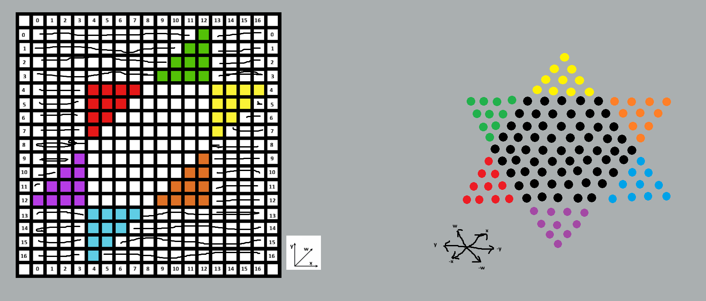
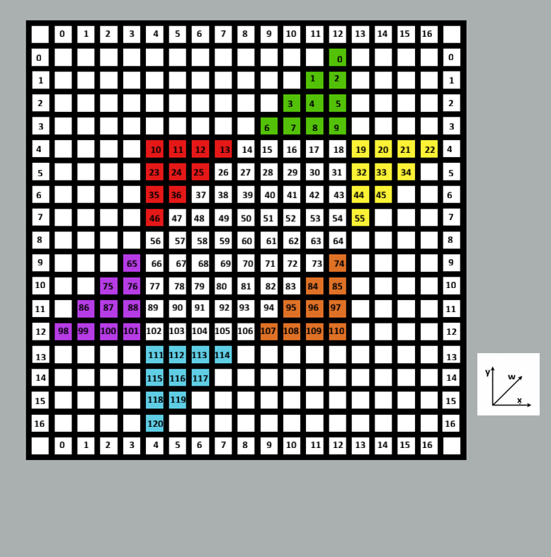

# Parallel_Chinese_Checkers_Engine

The goal of this project is to create a Chinese Checkers engine that can work with up to 6 players in the game with speed and accuracy. There are also parallelized implementations using the [Lazy SMP](https://www.chessprogramming.org/Lazy_SMP) method. Currently, the code can be compiled with GCC 23 or later, which can just be done by cloning the repo and using the makefile. Below, the techniques used are outlined and explained.

# Representing the board

The Chinese Checkers board is represented both with bitboards and 2D Arrays. The bitboards allow for fast runtime operations and the arrays can be used to precompute tables.

## 2D Arrays

A Chinese Checkers board may seem tricky to represent in a matrix because the game is played on a hex grid rather than a traditional gridworld like chess and checkers. This means that there are 6 degrees of freedom, a piece has 6 directions to move in. This hex grid can be represented in a 2D array by defining axes on both domains and translating, as seen below:



We have defined the x,y, and w axes on the right. By defining the w axis on the 2D grid as 1 move in the x direction and 1 move in the y direction, we can translate in all 3 directions despite being on the 2D matrix. For example, we can see on the right that the top left green marble is 12 spaces away from the bottom purple marble on the w axis. By starting at that same purple sapce on the left and moving 12 spaces diagonally in the w direction on the grid, we can move between those same two marbles in both domains.

## Bitboards

In chess engines, a [bitboard](https://www.chessprogramming.org/Bitboards) refers to a 64-bit value where each bit represents one square of the 64 square (8x8) chess board. It is simple to calculate the corresponding rank and file (row and column) of a bit given the symmetric nature of the chess board. Chinese checkers does not have these same convienences, with the board having more than 64 spaces and not being an 8x8 grid. The board has 121 spaces, so we can use a 128-bit value to represent it. We have mapped each space to a bit:



In this example, the bitboard representing the green player's marbles would have bits 0-9 set (```0b000....0001111111111```) and the blue player's would have bits 111-120 set. If we did a bitwise AND of the bitboard of each player's pieces, the result would be a bitboard where each set bit represents a marble on that space. Bitboards allow for faster operations than exploring a grid.

# Move Generation

To generate possible moves of a position, we use our 128-bit values (bitboards) and precomputed tables (maps and bitboards) to generate moves using bitwise operations, which is much faster than exploring the 2D array that represents our board.

## Generating Tables

The tables that tell us what spaces a piece can move to at a specific space are all bitboards. We could hardcode these, but we can also treat the 2D array as a graph and explore it to create these tables before any move generation is done.


The table for single-space moves you can perform at each space is a bitboard with the bits for each adjacent space set. Similarly, there is a separate table for jumps you can make from that space, with the corresponding bits set for spaces that are a distance of two in any of the three directions. We also include a map for the spaces that would be jumped over in each jump. This will enable us to make quick checks on if a marble is there to be jumped over if we can jump to an empty space.

For space 0:  
Moves table: ```0b000...0000110``` - bits 1 and 2 set  
Jumps table: ```0b000...0101000``` - bits 3 and 5 set  
Half Jumps Map: ```{5:2, 3:1}``` - if we jump to space 5, space 2 must be occupied

## Runtime Move Generation

### Getting the Player's Piece Locations

We start by using the bitboard that represents the locations of each marble belonging to the turn player. To get the location of the first piece, we can count the amount of trailing zeros in the bitboard (this is done with a quick assembly instruction like BSF or TZCNT). Using the above green pieces where this bitboard is ```0b000....0001111111111```, this would return 0. We now know that the turn player has a piece on space 0. Next, we unset bit 0 since we already know there is a piece there. This can be achieved with quick bitwise operations, of which we use the latter:

```pieceBitboard AND NOT (1<<SpaceIndex)```: This is just a bitwise AND with a value with everything but the space's bit set  
```pieceBitboard & (pieceBitboard-1)```: Subtracting 1 turns the bit we want to unset to 0 and everything to its right to 1. Since we know everything to its right is 0, a bitwise AND with the original and the subtracted result clears the bit we want to clear and everything to its right is remains 0. This takes 1 less operation with the same result, which may increaase speed, although it is possible the compiler precomputes the shift left operation in the previous code.

At the moment, using assembly-level directives for 128-bit values may not work as intended, so we perform this process on both the high and low 64 bits of the turn player's bitboard.

We repeat this process to get the locations of all of the turn player's pieces.  

### Using Piece Locations to Generate Possible Moves

We have the previously mentioned tables (Moves, Jumps, Half Jumps) for each space. We use the tables for each space that one of our piece is on. Using bitboards and maps allows us to generate moves

To generate the moves where a marble hops to an adjacent space, we can simply take our Moves table for the marble's current position,```moves[space_num]``` and the bitboard representing every player's pieces ```occupied``` (every bit is set where any player has a marble). We compute ```moves[space_num] AND (NOT occupied)```, which will give us a 128-bit value where every bit that is set corresponds to a space that is both unoccupied by any piece and is a valid move from the current piece's space. On our example board, if we used the marble at space 6, we would be returned a value with only bits 14 and 15 set. We repeat this process for every one of the player's pieces and store the space that they moved from to the space they can end on with each move.

For the jumps, which can be consecutive, similar to checkers, it is slightly more complicated. In Chinese Checkers, since a piece is not captured after being jumped over, players can jump back and forth and take multiple routes to have the same marble and the same spot. Thus, multiple moves can have the same outcome and we should keep track of just the starting end ending space for each move.  
To get all the spaces that we can jump to for each piece, if there is a space that can be jumped to, we should also check if there are other spaces that can be jumped to from that space. For our purposes, [DFS](https://en.wikipedia.org/wiki/Depth-first_search) or [BFS](https://en.wikipedia.org/wiki/Breadth-first_search) will work, and we use DFS. We keep a 128-bit value that functions as a hashmap to check if we have already explored options for jumping to a space so as not to repeat infinitely.

DFS pseudocode:
```bash
DFS_Generate_Moves(){
  possible_moves = []  
  for p in turn player's piece locations:  
    hashmap = 0
    stack = [p]
    while stack is not empty:
      v = stack.pop()
      hashmap.set_bit(v)
      for w in legal possible jumps from position v:
        if bit_is_not_set(hashmap[w]):
          possible_moves.push(<p,w>)
          stack.push(w)
  return possible_moves
}
```
Some bitwise operations used here:  
Setting a bit of the hashmap: ```hashmap = hashmap OR (1 << bit_num)```  
Checking if a bit of the hashmap is set: ```hashmap AND (1 << bit_num)``` is 0 if the bit is not set

Similar to generating the one-space moves from earlier, to generate the possible empty spaces we can jump to from a space, we use a bitwise operation, ```jumps[space_num] AND (NOT occupied)```, and the resulting set bits are empty spaces 2 units in any direction. We also need to check if the space that we jump over is occupied. To do this, we use the Half Jumps map from earlier. We use the map to determine what the space in between the two spaces is and check if that space is occupied. For example, if we want to jump from space 3 to space 14 because 14 is unoccupied, we need to know if space 6 is occupied. We would use the map like this to know that we have to check bit 6: ``` bit_num = HalfJumps[3][14]```. Since bit_num is 6, we check if bit 6 of ```occupied``` is set or not to know if we can jump.

# Win Conditions and Heuristics

We use precomputed tables to define the win conditions, as well as create our heuristic (piece value) tables...TODO

# Pessimistic Alpha-Beta Minimax Search

# Transposition Table

# Lazy SMP
